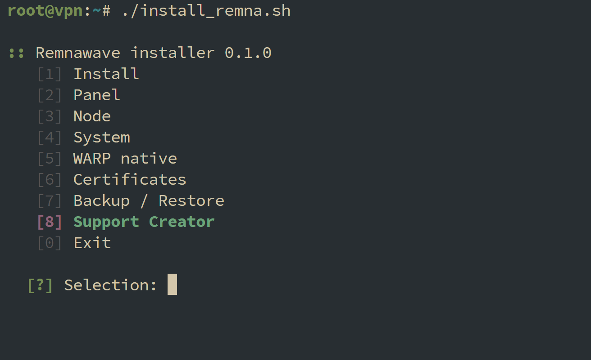

# Remnawave Installer

**Remnawave Installer** is an open-source installer and operations menu for building a Remnawave stack without hand-assembling every service, proxy rule, certificate, and node connection yourself.

It is designed for clean VPS deployments where you want to go from an empty server to a working Remnawave setup with a guided flow, then keep the same tool around for maintenance.

The installer targets **Remnawave v3 only**. It does not support v2 or migrate existing v2 installations. New installations use the matching `.env` and Compose templates from release `3.4.4`, with the backend image on the `:3` channel. Updates stay within that major version; explicitly pinned `3.x` image tags remain pinned.

## Overview

The project helps deploy and manage:

- Remnawave Panel
- Remnawave Node
- Remnawave subscription page
- Caddy or NGINX reverse proxy
- TLS certificates
- backups and restore
- optional native WARP routing
- creator support information

Instead of being a one-time script that disappears after installation, **Remnawave Installer** behaves like a small server console. You can install, update, restart, inspect logs, reconfigure the subscription page, work with certificates, and manage nodes from the same menu.

## Supported Systems

| Distribution | Status | Notes |
| --- | --- | --- |
| Ubuntu 22.04 LTS | Supported | Recommended stable target |
| Ubuntu 24.04 LTS | Supported | Recommended new target |
| Debian 12 | Planned | Not enabled until tested end-to-end |
| Other apt-based systems | Experimental idea | Requires validation before support |

## Deployment Modes

### Single Server

Panel, Node, reverse proxy, certificates, and subscription page are installed on one machine.

Best for:

- personal setups
- small deployments
- testing
- fast first launch

### Distributed

Panel runs on one server, while Nodes run on separate machines.

Best for:

- scaling traffic
- separating management from edge nodes
- running several locations
- cleaner production topology

### Maintenance Mode

After installation, the same menu can be used to manage the stack:

- start, stop, restart
- update services
- view logs
- recreate subscription page
- reinstall while preserving data
- create backups
- restore from backups
- manage WARP native routing
- open Support Creator details

## Domain Plan

Prepare DNS before running the installer.

Recommended layout:

| Purpose | Example |
| --- | --- |
| Panel | `panel.example.com` |
| Subscription page | `sub.example.com` |
| Node address | `node.example.com` or server IP |

For certificate issuance, these records must point to the correct server and ports `80/tcp` and `443/tcp` must be reachable.

## Quick Start



Download the installer and run it as root:

```bash
bash remnawave_installer.sh
```

The entrypoint can be exposed as a one-line install command:

```bash
bash <(curl -Ls https://raw.githubusercontent.com/cluedesc/remnawave-installer/main/remnawave_installer.sh)
```

## Menu

```text
1. Install
2. Panel
3. Node
4. System
5. WARP native
6. Certificates
7. Backup / Restore
8. Support Creator
9. Diagnose installation
0. Exit
```

## Features

### Input and Recovery

Invalid passwords, domains, URLs, email addresses, ports, and numbered selections are requested again. Admin password requirements are shown before entry: at least 24 characters, including uppercase letters, lowercase letters, and numbers. Failed authentication lets you retry or return to the Panel URL prompt.

Use `/back` to go to the previous wizard step, or the enclosing menu for standalone actions. Use `/cancel` or Ctrl+C to leave an operation. These commands are reserved in input fields, including hidden fields. An empty answer still accepts the displayed default.

An operation failure shows the last recorded step and a suggested next action, then returns to the menu. Completed changes generally remain in place; the installer does not automatically undo an interrupted installation. **Install -> Continue Panel setup** checks the actual backend, public access, administrator registration, and subscription page before continuing. It preserves existing secrets and avoids creating another administrator or replacing an existing subscription token. Setup choices are saved in a private draft between launches. Missing original configuration files require recovery from a backup.

You can also finish admin creation through **Panel -> Create Panel admin** or subscription setup through **Panel -> Configure subscription page**.

### Dashboard and Diagnostics

The main menu shows the Panel URL, backend image tag, container states, local certificate expiry, and the latest backup information. An image tag is not a verified exact runtime version. Failed or unavailable probes are shown as unknown rather than healthy.

**Diagnose installation** performs bounded, read-only checks of the API, database readiness, subscription health, DNS, HTTPS, listening ports, and disk usage, with suggested next steps. It does not test an external firewall or complete delivery of a user's subscription.

**System -> Export diagnostic report** writes a private text report under `/etc/remnawave-installer/reports`. Reports contain selected status facts and validated operation metadata, including public domains and DNS addresses. They exclude raw logs, environment files, passwords, tokens, and private keys.

### Installation

- Panel installation
- Node installation
- combined Panel + Node installation
- base package setup
- Docker and Docker Compose setup
- guided first admin creation

### Reverse Proxy

- Caddy support
- NGINX + Certbot support
- automatic TLS flow
- dedicated subscription page domain
- clean root response for subscription domain
- real subscription paths proxied to the subscription page service

**Panel -> Configure domain / HTTPS** changes the Panel domain or certificate email, or retries a failed HTTPS setup. Managed configuration and credentials are saved before the change, and public access is checked before committing the new settings. On failure the installer attempts to restore the previous managed configuration; private recovery snapshots remain in `/opt/remnawave/.https-backup.*`. Check any rollback error before continuing. Installed packages and certificate stores are outside this configuration rollback. Switching between an existing Caddy and NGINX installation requires a separate proxy migration.

### Subscription Page

- separate service configuration
- separate public domain
- automatic API token creation
- compose override instead of destructive edits

### Node Management

- guided Node setup
- Panel API authentication
- config profile selection
- inbound selection
- automatic Node creation when possible
- manual secret fallback when needed

### Maintenance

- service status
- logs
- update
- restart
- reinstall while preserving config and volumes
- safe removal modes
- backup and restore

Panel updates and reinstalls require a successful database backup. Reinstall preserves the existing Compose files, `.env`, and Docker volumes; it does not replace your service configuration with a downloaded template. The database and Redis start first, followed by the backend; dependent services start after the backend becomes healthy.

### Backup and Restore

Full backups contain a PostgreSQL custom-format dump, Panel and Node configuration, the subscription Compose override, installer state, and the managed Caddy/NGINX configuration files. A failed dump or archive operation does not publish a backup. Archives are private and contain credentials: store an off-server copy securely.

**Backup / Restore** lists archives with their dates and sizes. Restore and **Verify backup** accept a listed archive or a manually entered path. Verification checks archive structure and, for a Panel backup, PostgreSQL dump catalog readability without replacing live data. It is not a full restore rehearsal. Concurrent backup and restore operations are blocked by a shared lock.

**Configure automatic backups** offers daily or weekly backups (Monday) at a chosen server-local time, plus retention by archive count and age. It installs a private backup runner and the `remnawave-installer-backup` systemd service/timer after confirmation. This also works when the installer is launched through process substitution. Failed timer activation restores the previous schedule where possible, and **Show backup schedule** distinguishes configured values from actual timer state. Reapply the schedule after upgrading the installer to refresh its saved runner.

Retention is applied only after a new backup passes verification. It affects archives marked as successfully created by this installer, preserves the newly created backup, and leaves unmarked archives alone. A failed backup never triggers pruning. A limit of `0` disables that limit; turning the schedule off stops automatic runs, while saved retention settings still apply to successful manual backups. Timer failures can be inspected with `journalctl -u remnawave-installer-backup.service`.

If the database is stopped, backup starts only PostgreSQL and returns it to its stopped state afterwards. Application services remain stopped during this operation.

Restore validates the archive and dump before replacing configuration or the database. It stops the existing services, restores the database, and starts the stack only after database restoration succeeds. Failures are reported; do not treat an unsuccessful restore as a usable deployment. Older configuration-only archives cannot be used for full restore.

For recovery on another server, install Docker/Compose and the chosen reverse proxy first. The PostgreSQL image referenced by the saved Compose file must already be available locally for dump validation. Docker images, TLS certificate storage, firewall rules, and WARP configuration are not included in these backups. Reissue or restore certificates separately and validate/reload the reverse proxy after recovery.

### Readiness Checks

Panel checks require a successful API response and valid HTTPS certificates. Subscription checks verify the service's internal health separately from the public HTTPS endpoint. Check an existing user's subscription URL to verify complete subscription delivery; the public root response alone does not prove it.

### WARP Native

- native WireGuard-based WARP interface
- start, stop, restart, remove
- status checks
- add or remove `warp-out` in a Remnawave config profile

### Support Creator

- visible `Support Creator` item in the main menu
- first-run support notice with the same support details
- crypto support options
- Tribute support link
- DonationAlerts support link

Support options:

| Method | Address / Link |
| --- | --- |
| BTC | `bc1quktsqka8g3tgd5thz8y2n93v2n8xga8yk5acd7` |
| ETH | `0x54fA3BAd92643EcDD599717F61515499cB493bb6` |
| ERC20/BEP20 | `0x54fA3BAd92643EcDD599717F61515499cB493bb6` |
| SOL | `DvULVG6Wi5ABLhr9UBHup6CJrQUsrnufjqwBiZGEgTWz` |
| ZEC | `t1TP7jQyFVs5LFzqVv7hPfZYfHPMrTcuyC4` |
| Tribute | <https://t.me/tribute/app?startapp=dMLC> |
| DonationAlerts | <https://donationalerts.com/r/cluedesc> |

## What Makes It Different

**Remnawave Installer** focuses on the whole operator experience, not only the first install.

It keeps the common tasks close:

- install the stack
- verify it
- fix it
- update it
- add a node
- configure subscription page
- recover from backup
- support the creator
- return to the menu

The goal is simple: fewer fragile manual steps, fewer repeated prompts, and a clearer path from empty VPS to maintained Remnawave service.

## Safety Notes

Run this on a fresh or predictable server.

Before installation, make sure you understand:

- which domains point to which server
- which web server you want to use
- whether Cloudflare proxy is enabled or disabled
- which firewall rules are active
- where Panel and Node should live

The installer avoids broad destructive cleanup and does not use global Docker pruning as part of normal operations.

## Roadmap

Potential future work:

- Debian support
- release-based install command
- better non-interactive mode
- configuration export/import
- safer migration tools

## Community

This project is intended to be open, readable, and practical. Issues, fixes, deployment notes, and documentation improvements are welcome.

If you use it on a real server, include your distribution, version, virtualization type, and reverse proxy choice when reporting problems. That information matters more than a generic "does not work" report.

## Regression Checks

Tests are optional for running the installer. For development, they require Bash, jq, OpenSSL, and standard Unix tools. They use temporary files and mock Docker/HTTP/systemd calls; they do not install services or contact a running Panel. They cover configuration, API calls, backup verification and retention, schedule activation rollback, readiness, navigation, setup continuation, HTTPS rollback, diagnostic reports, and operation failure recovery. Linux permission, locking, and systemd behavior also need validation on a supported server; Windows test runs cannot establish these properties.

```bash
bash -n remnawave_installer.sh
for test_file in tests/*.sh; do bash "$test_file" || exit 1; done
```

A real Ubuntu/Docker installation and database restore should also be checked before a production deployment.
